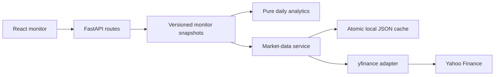

# Delivery notes

## Implemented scope

The focused G10 FX monitor is implemented across the Python API and React UI.
It covers 45 canonical direct pairs across USD, EUR, GBP, JPY, CHF, CAD, AUD, NZD,
NOK, and SEK. Missing direct quotes are shown explicitly, never synthesized.

| Layer | Implementation |
| --- | --- |
| Data | yfinance requests, UTC minute bars, provider-local daily dates, invalid-price checks |
| Sessions | Conservative finalized daily cutoff and explicit weekly FX calendar |
| Refresh | Four provider workers, one retry, request timeouts, cooldown, deduplication |
| Storage | Atomic versioned JSON cache under data/cache; local browser watchlist |
| Analytics | Geometric baseline, log-price z-score, five-session change, realized volatility |
| API | Health, registry, monitor, quote, history, and refresh endpoints |
| Interface | Ranking, filters, sorting, pair charts, pinning, refresh, CSV, methodology |
| Delivery | Development launcher; built frontend optionally served by FastAPI |

## Validation

- 20 offline backend tests: independent numerical calculations, no future-data
  leakage, missing/invalid observations, zero variance, warm-up, daily cutoff,
  DST/weekends, provider failures, cache restoration, refresh deduplication, API
  validation, and chart/ranking snapshot consistency.
- Three browser integration scenarios: complete research workflow, narrow-screen
  overflow and dialog use, and explicit API-outage handling.
- TypeScript / production build and Python lint checks.
- Real Yahoo coverage scan: 43 eligible daily series for a 252-session baseline
  on September 6, 2026. NZD/NOK and NZD/SEK lacked usable daily history.
- Desktop and mobile chart/layout inspection against source-backed API responses.
- All 43 eligible daily z-scores reconciled independently to retained provider
  closes; live EUR/USD history matched its ranking snapshot.

## Practical limits

Yahoo is an unofficial research data source with variable quote freshness and
coverage. The session/holiday policy is conservative; it is not a certified FX
fixing calendar. One API worker is supported. Price z-scores are descriptive,
not economic valuation or a trade signal. See METHODOLOGY.md and DATA_SOURCES.md.

## Deliberately outside this version

Macro-factor models, carry-adjusted fair value, backtesting, transaction costs,
order execution, accounts, public deployment, and alerts. These would each need
additional requirements and validated inputs rather than extra UI placeholders.
